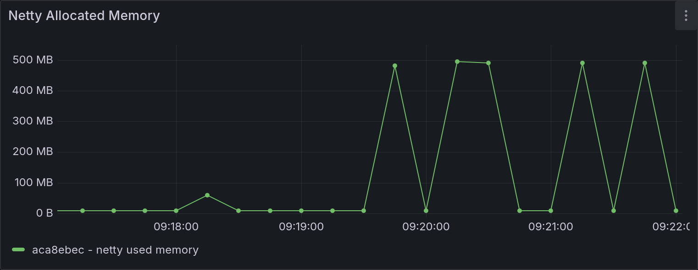
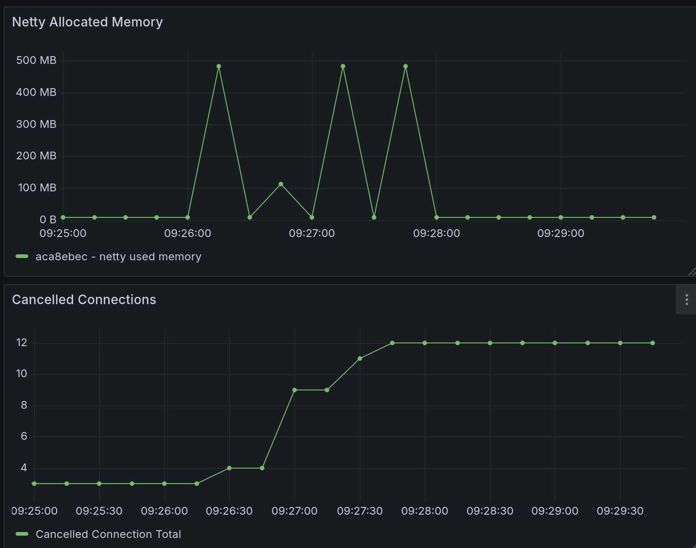
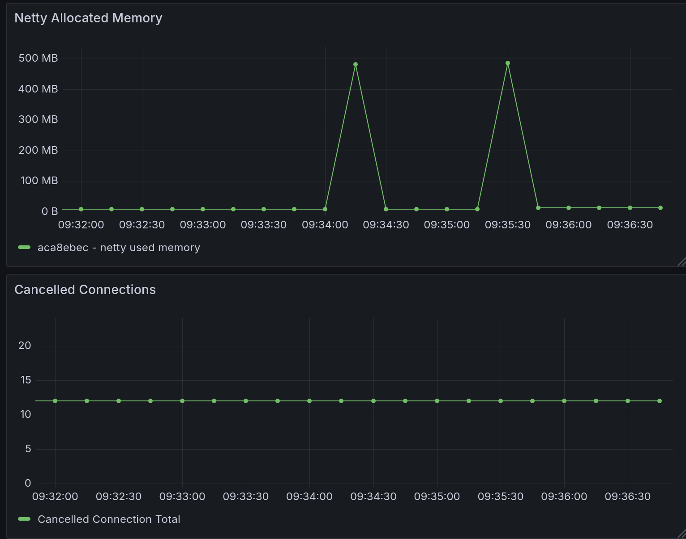
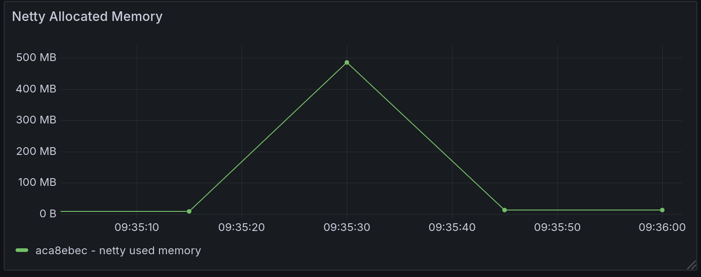
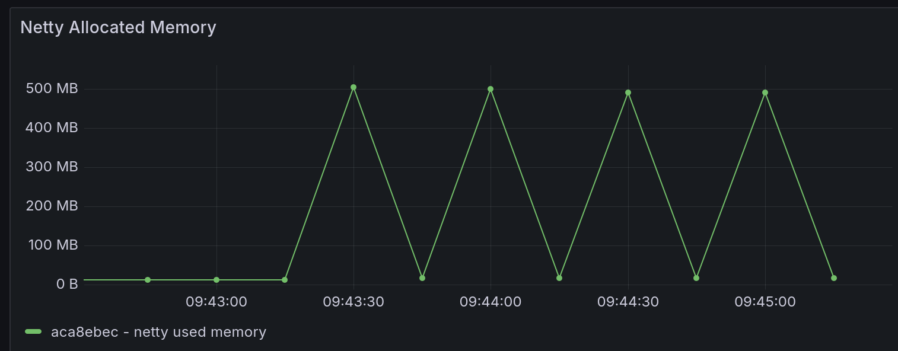

= Memory Leak Investigation

This document shall focus on investigating memory leaking.

We shall start with https://github.com/xtdb/xtdb/issues/4757 - current running theory is that this relates to cancelled queries leaving behind some state in netty - presumably we need to be using DIRECT memory at the time, so need to force that in some way.

* Large JOIN queries seem to be the most likely culprit for direct memory usage - so we should try to reproduce with a large JOIN query, and then cancel it.

== Setup / Method

For this, will setup:

* Setting up a REPL with:
** A limited amount of JVM - `JDK_JAVA_OPTIONS="-Xmx3000m -Xms3000m -XX:MaxDirectMemorySize=3000m -XX:MaxMetaspaceSize=500m"`
** A number of memory leak tracking opts: `-XX:+UnlockDiagnosticVMOptions -XX:+PrintNMTStatistics -XX:NativeMemoryTracking=detail -Darrow.memory.debug.allocator=true -Dio.netty.leakDetection.level=paranoid`
* Run a memory only node - don't want anything pulled into memory cache to confuse things in terms of tracking netty memory usage.
** Added the following config to dev.clj
+
[src, clojure]
====
(def debug-config
  {::xtdb {:node-opts {:server {:port 5432
                                :host "*"}
                       :healthz {:port 8080
                                 :host "*"}}}})
(ir/set-prep! (fn [] debug-config))
====
* Setup prometheus & grafana from dev/monitoring to track metrics - specifically Netty memory usage.

Then, to attempt to replicate the issue:

* Connect to the node with psql.
** `psql -h 0.0.0.0 -p 5432 -d xtdb`
* Run a query that should have a large direct memory usage, ie, a large LEFT JOIN query:
+
[src, sql]
====
SELECT * FROM GENERATE_SERIES(1, 10000000) AS l(n) LEFT JOIN GENERATE_SERIES(1, 10000000) AS r(m) ON n = m ORDER BY n LIMIT 100;
====
** Due to left join build ordering, should be quick on the heap memory side but should need to allocate a lot of direct memory for the output.
* I can then cancel the query from psql with Ctrl-C, if I want to.

== Initial observations

Initially, I just wanted to see how the direct memory usage looks over time as I run the above query to see if I can spot anything odd. I would expect:

* Some amount of direct memory usage as the query runs - this should be reflected in the netty memory usage metric.
* Following the query completing, the netty memory usage should drop back down to near zero, as the memory is released.

So, running the large generate series WITHOUT cancelling, I see the following (this is the results of a few different simultaneous runs):



As we can see:

* Netty memory usage spikes to around 500MB during the query, which seems reasonable.
* It will remain at that value for a while as I fetch the results, but then it drops back down to near zero as expected.

All good so far - now, if we cancel a few of those queries (ie, I use CTRL+C on pgwire), we see the following (a side by side view over netty allocated memories and cancelled connection count):



Interestingly: 

* Netty memory usage does 'top off' at different points, depending on when I cancel the query.
* The usage does drop back down to near zero afterwards, which would suggest that there isn't a leak in this case.

To try something a bit more drastic, rather than cancelling the queries with CTRL+C, I instead just kill the psql process mid query. This results in the following:



So:

* Cancelled connections is, interestingly, unchanged.
* Again, netty memory usage goes up to around 500MB, and then drops back down to near zero.

However, looking a bit closer at values following one of these kills:



Hard to see from the graph, but:

* Prior to the query, netty used memory sat at 8.4MB (this was true for all of the graphs above - not sure what I may have initially to have prompted that).
* AFTER the query - netty used memory sits at 12.6MB.

Now that isn't particularly drastic, but it does suggest that there may be some small amount of memory that isn't being released following a killed query, in certain cases.

* This didn't happen for BOTH of the killed queries I ran, only when I killed the query very quickly.
* Presumably will relate somewhat to "when" the thing was cancelled.

Following this, here's what happens when I run the query and send the cancel signal IMMEDIATELY after starting the query, a few times in quick succession:



* After the first of these, my "base" value became 16.8MB.
* The following queries didn't share the same behaviour.

Still, it is interesting to see that the netty memory usage can increase in this way, even if it is only a small amount. ALSO - it's been the same amount each time (4.2MB) - which is pretty interesting in itself.

=== NMT statistics fail

In this instance, printed NMT statistics from the REPL into the terminal output, but they were truncated by the scrollback limit, so I do not have the full values here. Have updated my debug REPL script to output to a file instead, so I can get the full output next time:

```
#!/bin/bash
export JDK_JAVA_OPTIONS="-Xmx3000m -Xms3000m -XX:MaxDirectMemorySize=3000m -XX:MaxMetaspaceSize=500m -XX:+UnlockDiagnosticVMOptions -XX:+PrintNMTStatistics -XX:NativeMemoryTracking=detail"
LOG_DIR="oom-investigation-notes/repl-logs"
LOG_FILE="$LOG_DIR/nmt-$(date +%Y%m%d-%H%M%S).log"
./gradlew :clojureRepl --bind 0.0.0.0 -PdebugJvm "$@" > "$LOG_FILE" 2>&1
```

I can also periodically run `jcmd <pid> VM.native_memory summary` to get a snapshot of the NMT stats at various point in time, so future runs will include that too.
