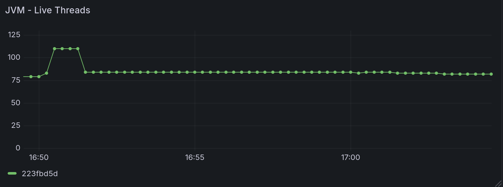

= Memory Leak Investigation

This document shall focus on investigating memory leaking.

We shall start with https://github.com/xtdb/xtdb/issues/4757 - current running theory is that this relates to cancelled queries leaving behind some state in netty - presumably we need to be using DIRECT memory at the time, so need to force that in some way.

* Large JOIN queries seem to be the most likely culprit for direct memory usage - so we should try to reproduce with a large JOIN query, and then cancel it.

== Setup / Method

For this, will setup:

* Setting up a REPL with:
** A limited amount of JVM - `JDK_JAVA_OPTIONS="-Xmx3000m -Xms3000m -XX:MaxDirectMemorySize=3000m -XX:MaxMetaspaceSize=500m"`
** A number of memory leak tracking opts: `-XX:+UnlockDiagnosticVMOptions -XX:+PrintNMTStatistics -XX:NativeMemoryTracking=detail -Darrow.memory.debug.allocator=true -Dio.netty.leakDetection.level=paranoid`
* Run a memory only node - don't want anything pulled into memory cache to confuse things in terms of tracking netty memory usage.
** Added the following config to dev.clj
+
[src, clojure]
====
(def debug-config
  {::xtdb {:node-opts {:server {:port 5432
                                :host "*"}
                       :healthz {:port 8080
                                 :host "*"}}}})
(ir/set-prep! (fn [] debug-config))
====
* Setup prometheus & grafana from `monitoring` to track metrics - primarily Netty memory usage.

Then, to attempt to replicate the issue:

* Connect to the node with psql.
** `psql -h 0.0.0.0 -p 5432 -d xtdb`
* Run a query that should have a large direct memory usage, ie, a large LEFT JOIN query:
+
[src, sql]
====
SELECT * FROM GENERATE_SERIES(1, 10000000) AS l(n) LEFT JOIN GENERATE_SERIES(1, 10000000) AS r(m) ON n = m ORDER BY n LIMIT 100;
====
** Due to left join build ordering, should be quick on the heap memory side but should need to allocate a lot of direct memory for the output.
* I can then cancel the query from psql with Ctrl-C, if I want to.

== Initial observations

Initially, I just wanted to see how the direct memory usage looks over time as I run the above query to see if I can spot anything odd. I would expect:

* Some amount of direct memory usage as the query runs - this should be reflected in the netty memory usage metric.
* Following the query completing, the netty memory usage should drop back down to near zero, as the memory is released.

So, running the large generate series WITHOUT cancelling, I see the following (this is the results of a few different simultaneous runs):


As we can see:

* Netty memory usage spikes to around 500MB during the query, which seems reasonable.
* It will remain at that value for a while as I fetch the results, but then it drops back down to near zero as expected.

All good so far - now, if we cancel a few of those queries (ie, I use CTRL+C on pgwire), we see the following (a side by side view over netty allocated memories and cancelled connection count):

image::cancelled-queries.png[]

Interestingly: 

* Netty memory usage does 'top off' at different points, depending on when I cancel the query.
* The usage does drop back down to near zero afterwards, which would suggest that there isn't a leak in this case.

To try something a bit more drastic, rather than cancelling the queries with CTRL+C, I instead just kill the psql process mid query. This results in the following:

image::killed-queries.png[]

So:

* Cancelled connections is, interestingly, unchanged.
* Again, netty memory usage goes up to around 500MB, and then drops back down to near zero.

However, looking a bit closer at values following one of these kills:

image::leftover-netty.png[]

Hard to see from the graph, but:

* Prior to the query, netty used memory sat at 8.4MB (this was true for all of the graphs above - not sure what I may have initially to have prompted that).
* AFTER the query - netty used memory sits at 12.6MB.

Now that isn't particularly drastic, but it does suggest that there may be some small amount of memory that isn't being released following a killed query, in certain cases.

* This didn't happen for BOTH of the killed queries I ran, only when I killed the query very quickly.
* Presumably will relate somewhat to "when" the thing was cancelled.

Following this, here's what happens when I run the query and send the cancel signal IMMEDIATELY after starting the query, a few times in quick succession:


* After the first of these, my "base" value became 16.8MB.
* The following queries didn't share the same behaviour.

Still, it is interesting to see that the netty memory usage can increase in this way, even if it is only a small amount. ALSO - it's been the same amount each time (4.2MB) - which is pretty interesting in itself.

=== NMT statistics fail

In this instance, printed NMT statistics from the REPL into the terminal output, but they were truncated by the scrollback limit, so I do not have the full values here. Have updated my debug REPL script to output to a file instead, so I can get the full output next time:

```
#!/bin/bash
export JDK_JAVA_OPTIONS="-Xmx3000m -Xms3000m -XX:MaxDirectMemorySize=3000m -XX:MaxMetaspaceSize=500m -XX:+UnlockDiagnosticVMOptions -XX:+PrintNMTStatistics -XX:NativeMemoryTracking=detail"
LOG_DIR="oom-investigation-notes/repl-logs"
LOG_FILE="$LOG_DIR/nmt-$(date +%Y%m%d-%H%M%S).log"
./gradlew :clojureRepl --bind 0.0.0.0 -PdebugJvm "$@" > "$LOG_FILE" 2>&1
```

I can also periodically run `jcmd <pid> VM.native_memory summary` to get a snapshot of the NMT stats at various point in time, so future runs will include that too.

== Thoughts from the above

I haven't particularly seen much direct evidence of a "leak" on cancelled queries as of the above - I am not entirely sure what the 4.2MB "jumps" in ambient netty usage are, but it is possible that this may relate to netty's own state management when handling data. 

I can say with relative confidence that it doesn't appear that EVERY cancelled/killed query leaves behind some state in netty, as I would expect to see a more consistent increase in the ambient netty memory usage if that were the case.

Given the correlation of "cancelled" error logs with memory spikes in netty as we have previously observed, it is still possible that there is some leaking going on here, though the exact conditions to trigger it are still unclear. 

Some potential areas of investigation:

* It may be that the leak only occurs when there are multiple simultaneous queries - perhaps multiple queries being cancelled at the same time on the same connection.
* Perhaps a leak occurs on an interrupt/cancellation during another error - ie, OutOfMemoryExceptions?
* It may be that a more complex/different query is required to trigger this - ie, the leak is only triggered in certain query plans,
** Some potential areas of interest there - other types of JOINs, GROUP BY, MATERIALIZED.
* The query may need to be cancelled at a particularly specific point in time - not unlike our previous memory leaks when an error occured when copying in direct memory.

In addition, I want to simplify my setup a bit:

* Would prefer to have the memory node setup & querying in the same file so I can run and test various things around connections from the REPL - this is currently a bit clunky with the psql connection, and it's hard to cancel things at specific points in time.
** Can look at pgwire_test for examples of pgwire usage.

== New test namespace

Rather than using dev.clj and pgwire, my new file ran at the REPL consists of the following:

```clojure
(ns memory-leak-investigation
  (:require [next.jdbc :as jdbc]
            [xtdb.node :as xtn])
  (:import [java.sql Connection]))

(def large-query
  "SELECT * FROM GENERATE_SERIES(1, 10000000) AS l(n) 
   LEFT JOIN GENERATE_SERIES(1, 10000000) 
   AS r(m) ON n = m 
   ORDER BY n
   LIMIT 100;")

(defn ->node []
  (xtn/start-node {:server {:port 5432
                            :host "*"}
                   :healthz {:port 8080
                             :host "*"}}))

(defn run-query [node]
  (let [connection-builder (.createConnectionBuilder node)]
    (with-open [^Connection conn (.build connection-builder)]
      (let [result (jdbc/execute! conn [large-query])]
        (println "First ten results of Query:" (take 10 result))))))

(defn run-and-cancel-query
  ([node] (run-and-cancel-query node 100))
  ([node sleep-ms]
   (let [connection-builder (.createConnectionBuilder node)]
     (with-open [^Connection conn (.build connection-builder)]
       (let [stmt (.createStatement conn)]
         (future
           (Thread/sleep sleep-ms)
           (.cancel stmt))
         (try
           (.executeQuery stmt large-query)
           (catch Exception e
             (println "Query was cancelled:" (.getMessage e)))))))))

(comment

  (def node (->node))

  (run-query node)
  
  (run-and-cancel-query node)

  (run-and-cancel-query node 1000)
  
  ;; when done/resetting
  
  (.close node)
  )
```

For the sake of comparison, I am using the same query as before - though can and will modify this query over time to see if I can trigger different behaviour / memory usage patterns.

== The 4MB Increments

Starting the node, I do a number of normal runs of the query, and see the following netty memory usage pattern:

image::clojure-normal-runs.png[]

Notes on this: 

* This graph shows the same query ran around 40 times in succession.
  * (This was originally intended to run 100 times, but I ran out of space on my device due to external sort)
* Over time, netty memory usage does increase by 4.2MB increments, even on normal runs, and this happens semi frequently.
* It then "settles" at a point, at which it will remain.

As an initial thought - we ARE using an in-memory node, and while we are not storing any data within tables, we will be storing transactions in the tx table AND in the in-memory log, so there is some state being kept in memory which grows over time. To verify this as the cause of the netty memory usage growth, I rewrote the node to be a "local" node:

```clojure
(defn ->node []
  (xtn/start-node {:storage [:local {:path "dev/oom-investigation/objects"}]
                   :log [:local {:path "dev/oom-investigation/log"} ]
                   :server {:port 5432
                            :host "*"}
                   :healthz {:port 8080
                             :host "*"}}))
```

Running the same set of 40 queries against the local node, I see the following netty memory usage pattern:


We still see this 4.2MB increment pattern, which would suggest that it isn't related to the in-memory tx table or log.

Also worth noting is the number of "live threads":

image::clojure-normal-runs-local-threads.png[] 

This climbs over time - one for each new connection - and stays there afterwards. 

Running ANOTHER set of 40 queries, I see the following for both netty memory usage and live threads:




Notes on this:

* Seems like the ambient netty memory usage here doesn't go much further beyond 232MB.
* In fact, after this set of queries, it's even lower, sat at around 120MB.
* It seemingly doesn't increase forever, and neither does the live threads count. 
* Some form of caching _may_ be responsible here, such as prepared statements. 

Hard to say exactly what this is, but it does seem like the netty memory usage is related to something that grows over time, but has a limit. It seems unlikely to be related to any specific leak.

== OOMKilled Repro with TPCH

Following some investigation by Jeremy, we arrived at a potential repro.

Running XTDB within docker:

```
mkdir -p /tmp/xtdb1;
sudo chown -R 20000:20000 /tmp/xtdb1;
docker run -v /tmp/xtdb1:/var/lib/xtdb \
    --env XTDB_LOGGING_LEVEL='DEBUG' \
    --env JDK_JAVA_OPTIONS='-Xmx1000m -Xms1000m -XX:MaxDirectMemorySize=2000m -XX:MaxMetaspaceSize=256m' \
    -p 5432:5432 -p 8080:8080 \
    --memory="5000m" --memory-swap="5000m" \
    --name="xtdb-oom-test" \
    --pull=always ghcr.io/xtdb/xtdb:edge 
```

And using the following from the REPL:
```
(ns memory-usage-tpch
  (:require [next.jdbc :as jdbc]
            [xtdb.datasets.tpch :as tpch]))

(defn ->connection []
  (jdbc/get-connection {:dbname "xtdb"
                        :host "localhost"
                        :port 5432
                        :classname "xtdb.jdbc.Driver"
                        :dbtype "xtdb"}))

;; submit TPCH SF 0.5
(with-open [conn (->connection)]
  (tpch/submit-dml-jdbc! conn 0.5))

;; followed by this query:
(with-open [conn (->connection)]
  (jdbc/execute! conn ["select count(*) from orders;"]))
```

Mid way through the TPCH submit, my docker container was OOMKilled (from docker ps --all):
```
9e8d9089a9b9   ghcr.io/xtdb/xtdb:edge "java -Dclojure.main…" 4 minutes ago   Exited (137)
```

Error code 137 is "killed" - ie, OOMKilled.

From `journalctl -k | grep -i oom`:
```
Memory cgroup out of memory: Killed process 22505 (java) total-vm:9079864kB, anon-rss:2799840kB, file-rss:25888kB, shmem-rss:0kB, UID:20000 pgtables:6252kB oom_score_adj:0
```

Some views of heap + direct memory usage graphs during the run:


Assuming our overall memory usage of XTDB can be summarized by Heap usage and netty direct memory usage, we can see that we don't even really approach the 5GB limit of memory we set on the container. 

* The same is true even if we assume the FULL heap was being used in memory!

This would suggest that something ELSE is using a large amount of memory that isn't being tracked by these metrics.

One last thing to note - the entirety of the xtdb1 directory itself is around 2.3GB on disk:

```
2304172	xtdb1/
```

Next steps here:

* What happens if we remove memory-swap here?
* Try to gather some metrics from Docker itself to see if we can get a better idea of what memory is being used by the container.

== Re-running without memory-swap

Re-running the above, but without memory-swap:

```
mkdir -p /tmp/xtdb1
sudo chown -R 20000:20000 /tmp/xtdb1
docker run -v /tmp/xtdb1:/var/lib/xtdb \
    --env XTDB_LOGGING_LEVEL='DEBUG' \
    --env JDK_JAVA_OPTIONS='-Xmx1000m -Xms1000m -XX:MaxDirectMemorySize=2000m -XX:MaxMetaspaceSize=256m' \
    -p 5432:5432 -p 8080:8080 \
    --memory="5000m" \
    --name="xtdb-oom-test" \
    --pull=always ghcr.io/xtdb/xtdb:edge 
```

This ran for a _bit_ longer, but was ALSO OOMKilled - so memory-swap wasn't the issue.

== Capturing & observing docker metrics

=== Setup

For the sake of capturing docker cAdvisor metrics and displaying all of our relevant metrics, I have taken a copy of `monitoring` and modified it as such:

* Added `cadvisor` to `docker-compose.yml`
* Ensured `prometheus` is scraping cadvisor metrics
* Added an additional dashboard for all the memory related metrics - from our existing metrics and from cAdvisor.

This lives under `oom-investigation-notes/monitoring-stack`.

=== Running the repro

Running the above repro, and observing the memory usage over time, we see the following (side by side - cAdvisor memory usage on top, our existing memory metrics below):


So:

* We can see that the working set memory from cAdvisor DOES go above the set limit, which is what causes the OOMKill.
* The resident set is quite a bit lower than this, and stays below the limit.
* The working set size is far larger than both our netty memory usage and our heap usage combined.
* The memory cache sits at around 2.5GB at peak, which when added to the resident set, would account for the working set size. 

== The Working Set

Ultimately,`container_memory_working_set_bytes` is what is used by k8s for the sake of making OOM decisions, so this value going above our set limit is the cause of our OOMKills.

So, important for us to understand what this value is, and what it consists of.

=== What is it?

From the Kubernetes link:https://kubernetes.io/docs/reference/instrumentation/metrics/[*Kubernetes Metrics Reference*]:

> `container_memory_working_set_bytes`
>
> "Current working set of the container in bytes".

Expanding on their meaning of "working set", from link:https://kubernetes.io/docs/tasks/debug/debug-cluster/resource-metrics-pipeline/#memory["Resource metrics pipeline"]:

> Memory is reported as the working set, measured in bytes, at the instant the metric was collected.
>
> In an ideal world, the "working set" is the amount of memory in-use that cannot be freed under memory pressure. However, calculation of the working set varies by host OS, and generally makes heavy use of heuristics to produce an estimate.
>
> The Kubernetes model for a container's working set expects that the container runtime counts anonymous memory associated with the container in question. The working set metric typically also includes some cached (file-backed) memory, because the host OS cannot always reclaim pages.

So, in summary, the working set is an estimate of the memory a container is actively using and that cannot be reclaimed under memory pressure.

It generally consists of:

* Anonymous memory (e.g. heap, stack)
* Some cached (file-backed) memory that the kernel cannot reclaim
* Other in-use memory (e.g. certain kernel allocations tied to the container)

It excludes:

* Free memory
* Easily reclaimable memory (e.g. parts of the page cache)

=== Comparing to Total

In our run, we see something quite interesting here when comparing the working set to the total memory usage from cAdvisor:


Specifically - the total memory usage is almost **identical** to our working set - ie, almost all of the memory being used by the container is considered to be "in use" and **not reclaimable**.

This seemingly includes (essentially) the entire container page cache, which is quite large - around 2.5GB at peak:


=== What the Page Cache Is

The page cache is RAM used by the Linux kernel to cache file-backed pages.
It sits between the process and the disk.

Contents:

* File data you've read (read() → kernel caches it)
* File data you've written (dirty pages waiting for flush)
* Memory-mapped files (mmap) — both read-only and read/write

A page in the cache is reclaimable if:

* It's clean (matches what's on disk) → Kernel can drop it instantly if memory pressure comes
* It's not pinned (i.e., no active mmap, DMA, or direct reference holding it)

==== When Pages Become Non-Reclaimable

Pages become "stuck" in the working set if:

* **Dirty but not flushed yet**
** Written to but not synced to disk
** Kernel must flush before reclaim
** If flushing is slow (disk IO bottleneck), dirty pages may pile up

* **Mapped into a process**
** If you mmap() a file (common in JVM world: JARs, RocksDB/Lucene indices, shared libs), the pages stay referenced
** They can still be evicted sometimes, but are harder to reclaim while mapped

* **mlock() or pinned by kernel/userspace**
** Explicitly locked into RAM → never reclaimable until unlocked

* **Cgroup memory accounting quirks**
** In Docker with memory limits, sometimes page cache is charged to the cgroup and appears non-reclaimable until eviction pressure hits

=== Potential Memory Double-Counting Theory

Haven't got a hard theory yet, but I am wondering if there's a problem with some leftover mmap stuff we're doing in XTDB - such as, for example, double counting memory in both the page cache and the allocator? 

Since we do some memory mapping and wrap foreign allocations in our RootAllocator, perhaps we are measuring the memory twice - once in the page cache and once in our allocator metrics. This could explain why so much of the page cache is non-reclaimable - because it's mapped into our process.

Alternatively - perhaps we are memory mapping and NOT counting it properly under the allocator, so any limits we are setting within the allocator are meaningless and not being respected.

I am specifically curious on the usage of mmap within the memory cache.

== Testing memory mapping usage

=== CLI tool

The `test_mmap.clj` program is a memory mapping testing utility that:

1. **Starts an XTDB node** to access the memory cache/buffer pool system
2. **Creates a byte buffer** of size 500MiB
3. **Stores the byte buffer** in the buffer pool using `putObject`
4. **Retrieves the byte buffer** using `getByteArray`, multiple times.
5. **Runs until manually stopped**, allowing observation of memory usage 

Code:
```clojure
(ns xtdb.test-mmap
  (:require [clojure.tools.logging :as log]
            [xtdb.node :as xtn]
            [xtdb.util :as util]
            [xtdb.db-catalog :as db-cat])
  (:import (java.nio ByteBuffer) 
           (java.util Random)
           (xtdb.database Database)))

(defn generate-random-byte-buffer ^ByteBuffer [buffer-size]
  (let [random (Random.)
        byte-buffer (ByteBuffer/allocate buffer-size)]
    (loop [i 0]
      (if (< i buffer-size)
        (do
          (.put byte-buffer (byte (.nextInt random 128)))
          (recur (inc i)))
        (.flip byte-buffer)))))

(defn create-500mb-buffer []
  (generate-random-byte-buffer (* 500 1024 1024)))

(defn run-test [node-opts] 
  (with-open [node (xtn/start-node node-opts)]
    (log/info "XTDB node started")

    (log/info "Waiting 1 minute for caches to warm up...")
    (Thread/sleep 60000)

    (let [^Database db (db-cat/primary-db node)
          buffer-pool (.getBufferPool db)
          test-path (util/->path "test-500mb.bin")
          test-buffer (create-500mb-buffer)]

      (log/info "Putting 500MB ByteBuffer into buffer pool...")
      (.putObject buffer-pool test-path test-buffer)
      (log/info "Successfully stored ByteBuffer")

      (log/info "Retrieving ByteBuffer from buffer pool...")
      (let [retrieved-data (.getByteArray buffer-pool test-path)]
        (log/info (format "Retrieved %d bytes" (count retrieved-data))))

      (Thread/sleep 10000)

      (log/info "Multiple retrievals from buffer pool...")
      (dotimes [i 5]
        (let [slice-data (.getByteArray buffer-pool test-path)]
          (log/info (format "Retrieval %d: %d bytes" (inc i) (count slice-data)))
          (Thread/sleep 10000)))

      ;; Keep running to observe memory patterns
      (try
        (while true
          (Thread/sleep 30000)
          (log/info "Still running - memory cache active"))
        (catch InterruptedException _
          (log/info "Test stopped"))))))
```

This is also added to the XTDB CLI under main.clj:

```
(def test-mmap-cli-spec
  [config-file-opt
   ["-h" "--help"]])

(defn- test-mmap [args]
  (let [{{:keys [file]} :options} (-> (parse-args args test-mmap-cli-spec)
                                      (handling-arg-errors-or-help))]
    (log/info "Starting memory mapping test...")
    ((requiring-resolve 'xtdb.test-mmap/run-test) (file->node-opts file))))
```

We build this as a docker image by building the local standalone docker image.

=== Running the test

For the dockerized XTDB image, I used the following command to run the `test_mmap.clj` program:

```bash
mkdir -p /tmp/xtdb1
sudo chown -R 20000:20000 /tmp/xtdb1
docker run -v /tmp/xtdb1:/var/lib/xtdb \
    --env XTDB_LOGGING_LEVEL='DEBUG' \
    --env JDK_JAVA_OPTIONS='-Xmx5000m -Xms5000m -XX:MaxDirectMemorySize=5000m -XX:MaxMetaspaceSize=256m' \
    -p 5432:5432 -p 8080:8080 \
    --name="xtdb-oom-test" docker.io/xtdb/xtdb test-mmap --file local_config.yaml
```

Ran alongside the monitoring stack to observe memory usage - I see the following memory metrics from cAdvisor and the XTDB node:


So here's what we see, most importantly:

* We can see the point when when we load the 524MB (500MiB) buffer into the memory cache.
  * At that time - our netty memory/direct memory allocation here goes also to 524MB.
  * ALSO at that time - the page cache increases by around 524MB.
* The heap memory increases as we load the buffer with getByteArray - though eventually drops back down.
* Both the resident and working memory sets increase over time - the working memory set is and remains around 524MB LARGER than the resident set.

I believe this supports the theory that we are double counting memory here - the 500MiB buffer is being counted in both the netty direct memory usage AND in the page cache, which will leading to an overestimation of our actual memory usage by Kubernetes.

== Attempt at a fix

Assuming that the issue lies within memory_cache using unpooled buffers, we've made a change in there to grab the same netty allocator used by arrow (PooledByteBufAllocatorL), to ensure that we respect the netty memory limits on creating our buffers in the memory cache. We rebuilt the docker image and then re-ran TPCH against it, so to summarize we run:

```
mkdir -p /tmp/xtdb1
sudo chown -R 20000:20000 /tmp/xtdb1
docker run -v /tmp/xtdb1:/var/lib/xtdb \
    --env XTDB_LOGGING_LEVEL='DEBUG' \
    --env JDK_JAVA_OPTIONS='-Xmx1000m -Xms1000m -XX:MaxDirectMemorySize=2000m -XX:MaxMetaspaceSize=256m' \
    --memory="5000m" \
    -p 5432:5432 -p 8080:8080 \
    --name="xtdb-oom-test" docker.io/xtdb/xtdb
```

This still fails, and the netty memory usage is very similar to as it was before:


=== Closing The FileChannel

Same as above, but also explicitly using .use() on the filechannel to ensure that also gets closed and doesn't permanently live in the page cache.

Once again, rebuilt the docker image and re-ran. Same result, essentially.

=== Setting memory reservation

Running through with the same changes, we wanted to see if we could "poke" the kernel into clearing up page cache, so we set a memory reservation on the docker container:

```
mkdir -p /tmp/xtdb1
sudo chown -R 20000:20000 /tmp/xtdb1
docker run -v /tmp/xtdb1:/var/lib/xtdb \
    --env XTDB_LOGGING_LEVEL='DEBUG' \
    --env JDK_JAVA_OPTIONS='-Xmx1000m -Xms1000m -XX:MaxDirectMemorySize=2000m -XX:MaxMetaspaceSize=256m' \
    --memory="5000m" \
    --memory-reservation="3000m" \
    -p 5432:5432 -p 8080:8080 \
    --name="xtdb-oom-test" docker.io/xtdb/xtdb
```

This similarly had essentially no effect - I also MANUALLY attempted to clear the page cache by running:

```
echo 3 | sudo tee -a /proc/sys/vm/drop_caches
```

This also had NO effect - the memory_cache values of the page cache remained unchanged.

=== Changes to main

Though the specifics to improve how we're handling memory within the memory_cache didn't have much of an impact on the overall memory usage/preventing OOMKills, I did want to ensure that we had the best possible handling of memory within the memory_cache, so I have merged these changes into main.

== Hypothesis on the Page Cache

My current thinking is that the page cache MUST be considered to be in use by unevictable pages - potentially that something holds open a file handle to the underlying files, which means that the pages cannot be evicted. As for what exactly is holding these files open, I am not sure - this could be something within netty, or arrow, or something with XTDB.

The TPCH process is dying entirely during ingest (currently) - so it's worth considering what may run/use memory during this process.

